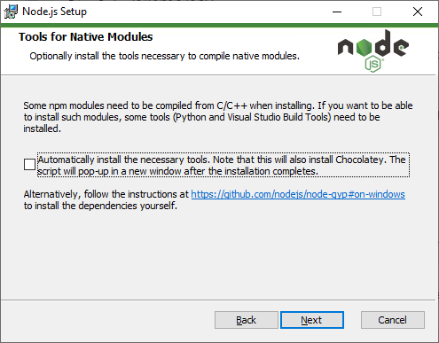
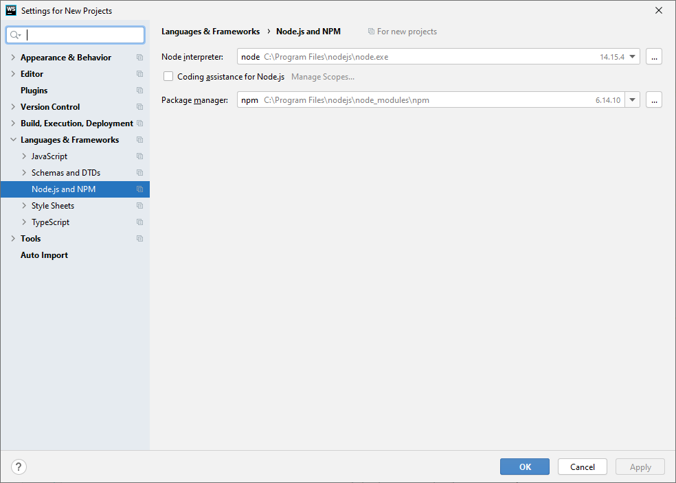

## Install Node.js

1. Go to the Node.js home page: [https://nodejs.org/en/](https://nodejs.org/en/) and download the most recent stable version of Node.js.  The long term support (LTS) version is appropriate for us in this class.
2. Follow the prompts to agree to the license agreement and install location
3. When asked about "Tools for Native Modules" leave this unchecked

   

4. The installer should copy files and perform setup and hopefully finish successfully

## Setting up WebStorm

Once node.js is installed, WebStorm should automatically pick up the location of the node interpreter.  To verify follow the following steps.

1. Open WebStorm
2. Select "File" -> "New Project Settings" -> "Settings for New Projects..."
3. Under "Languages & Frameworks" select "Node.js and NPM"

   

4. Check that the path to the "Node interpreter" and "Package manager" is set to the installation paths of node.exe and npm
5. Make sure that 'Coding assistance for Node.js' is checked

## Create and run Hello World in Node.js

1. In WebStorm, create a new project - Select "Empty Project" as the project type
2. Create a new JavaScript file for your project (call this file ```hello.mjs```)
3. Enter the following code in your ```hello.mjs``` file

   ```javascript
   console.log("Hello World!");
   ```

4. Right-click on the ```hello.mjs``` file and click on ```Run 'hello.mjs'```.  You can also press CTRL + Shift + F10
5. If all was set up correctly you should see something similar to the following printed to the Webstorm Run output window

   ```text
   "C:\Program Files\nodejs\node.exe" C:\Users\Me\WebstormProjects\se2840\HelloWorld\hello.mjs
   Hello World!

   Process finished with exit code 0
   ```
